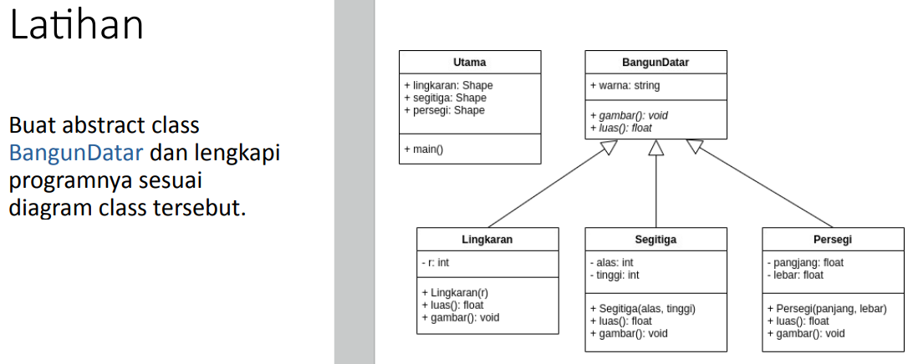

# Tugas Pertemuan 6
## Pemrograman Orientasi Objek

```sh
Nama   : Raihan Tantowi
Nim    : 312110229
Matkul : Pemrograman Orientasi Objek
```
### Soal


#### 1. File BangunDatar.java
* **Class BangunDatar (Abstract Class) :**
```java
package AbstractClass;

public abstract class BangunDatar {
    String warna;
    public String getWarna() {
        return this.warna;
    }

    public void setWarna(String warna) {
        this.warna = warna;

    }
    public abstract void gambar();
    public abstract float luas();

}
```

#### 2. File Lingkaran.java
* **Class Lingkaran (Class Turunan) :**
```java
package AbstractClass;

public class Lingkaran extends BangunDatar {
    private int r;

    public Lingkaran(int r) {
        this.r = r;
    }

    @Override
    public void gambar() {
        System.out.println("Gambar Lingkaran");
    }

    @Override
    public float luas() {
        return (float) (Math.PI * r * r);
    }
}
```

#### 3. File Segitiga.java
* **Class Segitiga (Class Turunan) :**
```java
package AbstractClass;

public class Segitiga extends BangunDatar {
    private int alas;
    private int tinggi;

    public Segitiga(int alas, int tinggi) {
        this.alas = alas;
        this.tinggi = tinggi;
    }

    @Override
    public void gambar() {
        System.out.println("Gambar Segitiga");
    }

    @Override
    public float luas() {
        return (float) (0.5 * alas * tinggi);
    }
}
```

#### 4. File Persegi.java
* **Class Persegi (Class Turunan) :**
```java
package AbstractClass;

public class Persegi extends BangunDatar {
    private float panjang;
    private float lebar;

    public Persegi(float panjang, float lebar) {
        this.panjang = panjang;
        this.lebar = lebar;
    }

    @Override
    public void gambar() {
        System.out.println("Gambar Persegi");
    }

    @Override
    public float luas() {
        return (panjang * lebar);
    }
}
```

#### 5. File Main.java
* **Class Main (Method Main) :**
```java
package AbstractClass;

public class Persegi extends BangunDatar {
    private float panjang;
    private float lebar;

    public Persegi(float panjang, float lebar) {
        this.panjang = panjang;
        this.lebar = lebar;
    }

    @Override
    public void gambar() {
        System.out.println("Gambar Persegi");
    }

    @Override
    public float luas() {
        return (panjang * lebar);
    }
}
```

* **Berikut adalah hasil output program:**

