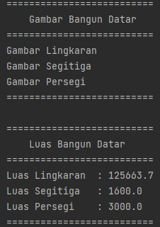

# Tugas Praktikum 6
## Pemrograman Orientasi Objek

```sh
Nama   : Raihan Tantowi
Nim    : 312110229
Matkul : Pemrograman Orientasi Objek
```
### Soal


#### 1. File BangunDatar.java
* **Class BangunDatar (Abstract Class) :**
```java
package AbstractClass;

public abstract class BangunDatar {
    String warna;
    public void setWarna(String warna) {
        this.warna = warna;
    }
    public String getWarna() {
        return this.warna;
    }
    public abstract void gambar();
    public abstract float luas();

}
```

#### 2. File Lingkaran.java
* **Class Lingkaran (Class Turunan) :**
```java
package AbstractClass;

public class Lingkaran extends BangunDatar {
    private int r;

    public Lingkaran(String warna, int r) {
        super.warna = warna;
        this.r = r;
    }

    @Override
    public void gambar() {
        System.out.println("Gambar Lingkaran: "+getWarna());
    }


    @Override
    public float luas() {
        return (float) (Math.PI * r * r);
    }
}
```

#### 3. File Segitiga.java
* **Class Segitiga (Class Turunan) :**
```java
package AbstractClass;

public class Segitiga extends BangunDatar {
    private int alas;
    private int tinggi;

    public Segitiga(String warna, int alas, int tinggi) {
        super.warna = warna;
        this.alas = alas;
        this.tinggi = tinggi;
    }

    @Override
    public void gambar() {
        System.out.println("Gambar Segitiga\t: "+getWarna());
    }

    @Override
    public float luas() {
        return (float) (0.5 * alas * tinggi);
    }
}
```

#### 4. File Persegi.java
* **Class Persegi (Class Turunan) :**
```java
package AbstractClass;

public class Persegi extends BangunDatar {
    private float panjang;
    private float lebar;

    public Persegi(String warna, float panjang, float lebar) {
        super.warna = warna;
        this.panjang = panjang;
        this.lebar = lebar;
    }

    @Override
    public void gambar() {
        System.out.println("Gambar Persegi\t: "+getWarna());
    }

    @Override
    public float luas() {
        return (panjang * lebar);
    }
}
```

#### 5. File Main.java
* **Class Main (Method Main) :**
```java
package AbstractClass;

public class Main {
    public static void main(String[] args) {
        // membuat objek BangunDatar dari class Lingkaran
        BangunDatar Ling = new Lingkaran("Biru", 200);

        // membuat objek BangunDatar dari class Segitiga
        BangunDatar Seg = new Segitiga("Coklat",80, 40);

        // membuat objek BangunDatar dari class Persegi
        BangunDatar Pers = new Persegi("Kuning", 50, 60);

        /* memanggil method gambar & luas bangun datar */
        System.out.println("==========================");
        System.out.println("\tGambar Bangun Datar");
        System.out.println("==========================");
        Ling.gambar();
        Seg.gambar();
        Pers.gambar();
        System.out.println("==========================");
        System.out.println();
        System.out.println("==========================");
        System.out.println("\tLuas Bangun Datar");
        System.out.println("==========================");
        System.out.println("Luas Lingkaran\t: " + Ling.luas());
        System.out.println("Luas Segitiga\t: " + Seg.luas());
        System.out.println("Luas Persegi\t: " + Pers.luas());
        System.out.println("==========================");
    }
}
```

* **Berikut adalah hasil output program:**

